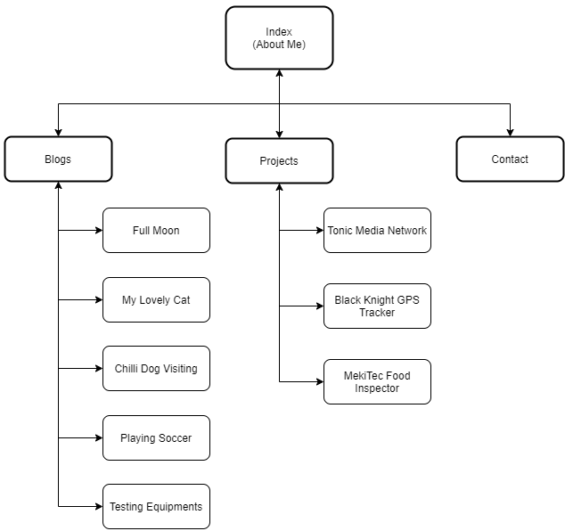

# Documentation of the Portfolio Assignment

## URL:
https://jazz0006.github.io/

## Repo:
https://github.com/Jazz0006/Jazz0006.github.io

## About this website

The T1A2 assignment of CCC course is to build our portfolio website. This is a good chance to practise my HTML and CSS knowledge (Javascript is not recommended at this time.)

It is also a good platform to display my experience, knowledge, projects, interests and other personal information. I will keep improving my site and use it as a showcase of myself in the future.

I took reference of example protfolio websites but manually typed in each line of codes in this website. It is really helpful to check out how each setting in CSS renders different result, and the interactive effect of settings in parent-child and peer elements.  

## Target audience:

Potential employers who is looking for an IT professional.

## Features:

* Semantic HTML
* CSS | Flex
* Responsive Layout
* Fixed Navigation Bar
* Favicon
* Button with hover effect
* Form for sending message
* Blog

## Sitemap:

## Screenshots:
On wide screen devices:

On mobile devices:

## Target Audience
Potential employers looking to engage a dev and/or IT professional. The audience are expected to have IT technical knowledge.

## Tech Stack:
- HTML
- CSS
- Deployed on Github